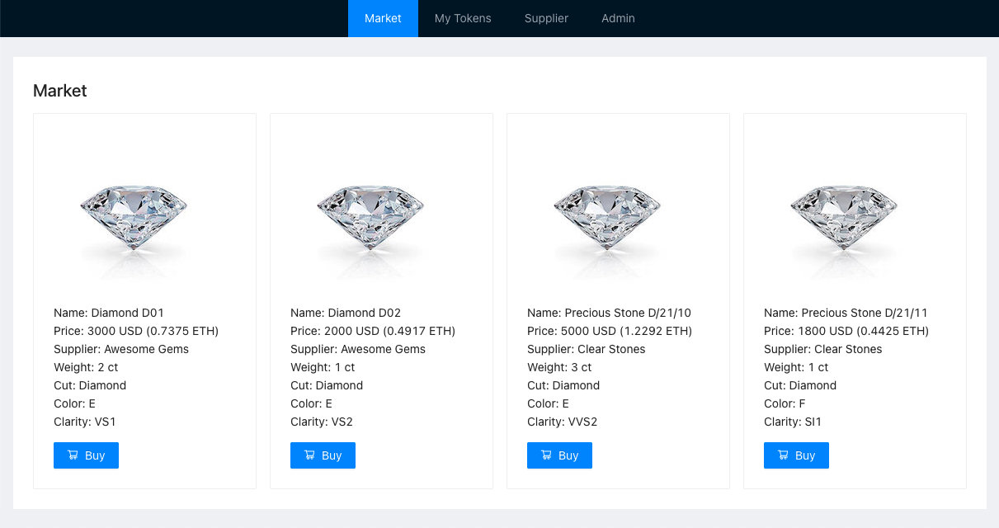

# 💎 Precious Stones Mint

[](https://nodejs.org/en/download/)
[](https://www.trufflesuite.com/)
[](https://docs.openzeppelin.com/)
[](https://www.heroku.com/)
[](https://ethereum.org/)
[](https://metamask.io/)

Digital form of gemstones to store characteristics, track origin and history of ownership, and ensure legit source that is ethical.

## Problem

Currently, there is lack of transparency when it comes to precious stones. Origin is often unknown and there is no full history of ownership. Moreover, the characteristic of an asset could be stored so that once verified becomes its integral part, hence doesn't allow tampering.

## Idea

The idea is to create decentralized market, where everyone can verify origin of gemstones and their characteristics.
As part of this exercise, I will deploy a smart contract to mint NFTs specifically for diamonds which besides typical parameters would keep its clarity, cut, carat and color.
Minting NFTs in the Ethereum using [ERC-721](https://ethereum.org/en/developers/docs/standards/tokens/erc-721/) can be replaced with *ERC-1155* in the future, to issue different tokens per different gems.

- Approved wholesale gemstone **Suppliers** would be able to add their products
- **Dealers** would be able to verify its origin
- **Clients** would be able to verify its origin, history, get familiar with its characteristics and purchase

## Hosting

Distributed application (dApp) is hosted on Heroku and available to use on https://precious-stones-mint.herokuapp.com/.
Be advised that free dyno on Heroku requires sleeping time, so the first opening of the page may take a bit longer.
Because the smart contract is using pricing feed, it was deployed to Rinkeby testnet.

## Project structure

```bash
.
├── client                                # UI of distributed app - dApp
│   ├── build                                 # Built result that can be served as dApp
│   ├── node_modules                          # Dependencies of dApp
│   ├── public                                # Public static assets for dApp
│   ├── src                                   # Source code for dApp
│   ├── package-lock.json                     # Locked versions of dependencies for dApp
│   └── package.json                          # List of dependencies and commands for dApp
├── contracts                             # Sorce code for smart contracts
│   ├── AggregatorV3Mock.sol                  # Smart contract to mock price feed
│   └── PreciousStoneToken.sol                # Sorce code of Precious Stoke Token
├── examples                              # Sample images to use for testing
├── migrations                            # Migrations to deploy smart contracts using Truffle
│   └── 2_deploy_contracts.js                 # Instructions for deployment of smart contracts
├── node_modules                          # Dependencies
├── test                                  # Tests for smart contracts
│   ├── fixtures                              # Mocked data for tests
│   └── precious_stone_token.js               # Unit tests for Precious Stone Token
├── package-lock.json                     # Locked versions of dependencies
├── package.json                          # List of dependencies and commands
├── Procfile                              # File used on Heroku to define what to run
└── truffle-config.js                     # Truffle configuration
```

## How to develop?

### Prerequisite

- Execute `npm install -g truffle` to install Truffle globally to be able to execute it from the command line
- Execute `npm install -g ganache-cli` to install Ganache CLI globally to be able to execute it from the command line
- Execute `npm ci` from the project root to install all other dependencies
- Execute `npm run dotenv` to prepare local `.env` file
- Execute `cd client && npm ci` to install all dependencies for the UI

### Contract Development

- Execute `truffle develop` to launch Truffle Develop
  - Alternative to execute `ganache-cli` in a separate tab
- Execute `truffle compile` to compile all smart contracts
- Execute `truffle migrate --network develop` to deploy smart contracts to local network
  - Alternative to execute `truffle migrate --network development` if using `ganache-cli`
- Execute `truffle test` to run unit tests for smart contracts
- Execute `.exit` to stop running Truffle Develop

### MetaMask wallet for UI Development

- Install [MetaMask browser extension](https://metamask.io/download.html) and open it
- Create a new network:
  - Name: `Truffle Develop`
  - RPC URL: `http://127.0.0.1:9545/`
  - Chain ID: `1337`
- Import some accounts using their private keys or mnemonic (both provided as a result of `truffle develop` or `ganache-cli` command)

### UI Development

- Execute `truffle develop` in a separate CLI to launch Truffle Develop
- Execute `cd client` to change path to main client directory
- Execute `npm start` to start local development server
- Open `http://localhost:3000` to see the result
- The page will ask to connect the currently selected account in the MetaMask wallet to the dApp
  - MetaMask setup is required and documented above 
  - Make sure to select *Truffle Develop* network and one of the imported accounts, and click *Connect* - you will only be asked once per an account
- Every change of account or network in MetaMask will automatically reload the page for convenience
- Execute some operations, MetaMask wallet will be opened automatically to sign each transaction
  - Use `examples` directory from project root for sample images of precious stones items
  - Hint: in case of `the tx doesn't have the correct nonce` error, open MetaMask, go to *My Accounts*, then *Settings*, then *Advanced* and click on *Reset Account*
- Execute `CI=true npm test` to run all unit tests for the UI

## How to run?

### Deploying the contract to Rinkeby testnet
- Use [Rinkeby Faucet](https://faucet.rinkeby.io/) to get some ETH for an account in Rinkeby testnet
  - Hint: use Twitter to publish a post with your Ethereum address, Facebook doesn't work
- Open MetaMask, select Rinkeby testnet and choose the account with some ETH there, to be able to deploy the smart contract
- Compile and deploy via Truffle:
  - Create new project in [Infura](https://infura.io) 
  - Copy endpoint URL for Rinkeby testnet and set as `INFURA_URL` environment variable in `.env` file
  - Copy restore phrase from MetaMask and set as `MNEMONIC` environment variable in `.env` file
  - Execute `truffle migrate --network rinkeby` to deploy smart contracts to Rinkeby testnet
- Compile and deploy via [Remix](https://remix.ethereum.org/):
  - Copy content of `PreciousStoneToke.sol` and paste into Remix on the first tab called *File Explorer*
  - Compile the code on the second tab called *Solidity Compiler* using the same version as mentioned in pragma
  - Open MetaMask, select Rinkeby network and proper account with some test ether there, and click *Connect*
  - Open third tab called *Deploy and run transactions*:
    - Choose *Injected Web3* environment
    - Select proper account (make sure it is connected to Remix in MetaMask)
    - Select proper contract (*PreciousStoneToken*)
    - Hit *Deploy*
  - Accept the transaction in MetaMask extension
- Deployment script will ask for `priceFeedAddress` constructor parameter - use contract address for *ETH/USD* price feed from [the list](https://docs.chain.link/docs/ethereum-addresses/) (e.g. `0x8A753747A1Fa494EC906cE90E9f37563A8AF630e` for Rinkeby)
- Use [Rinkeby Etherscan](https://rinkeby.etherscan.io) page to see details of deployed contract using its address

### Running on Heroku

- Create a new app in Heroku (`heroku-20` type of stack)
- Go to *Settings* and add the following *Buildpacks*:
  - `heroku/nodejs`
- Go to *Settings* and add the following mandatory *Config Vars*:
  - `REACT_APP_CONTRACT_ADDRESS` (use `PreciousStoneToken` smart contract address after it has been deployed to Rinkeby or leave empty to deploy the contract)
  - `REACT_APP_IPFS_PROJECT_ID` (IPFS project ID provided by [Infura](https://infura.io))
  - `REACT_APP_IPFS_PROJECT_SECRET` (IPFS project secret provided by [Infura](https://infura.io))
- Go to *Settings* and add the following optional *Config Vars* if smart contract should be deployed:
  - `INFURA_URL` (use endpoint URL for Rinkeby testnet from [Infura](https://infura.io))
  - `MNEMONIC` (use restore phrase from MetaMask)
- Go to *Deploy* and connect app to *GitHub* repository
- Push `master` branch
- Go to *Deploy*, choose `master` branch and then hit *Deploy Branch* button (or enable automatic deployments)

## Preview of the dApp



A screencast of walking through the project is available [here](https://vimeo.com/raciat).
